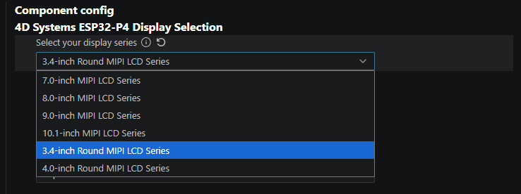

# 4D Systems' ESP32-P4 series displays

Implementation of the LCD controller with esp_lcd component for 4D Systems' ESP32-P4 series displays.

| 4DLCD Series                                                                                          | Supported | LCD Controller                                      | Interface |
|:----------------------------------------------------------------------------------------------------- |:---------:|:---------------------------------------------------:|:---------:|
| [ESP32-P4-70 Series](https://resources.4dsystems.com.au/datasheets/esp32p4/esp32-p4-series/)          | ✅       | JD9365                                              | MIPI      |
| [ESP32-P4-80 Series](https://resources.4dsystems.com.au/datasheets/esp32p4/esp32-p4-series/)          | ✅       | JD9365                                              | MIPI      |
| [ESP32-P4-90 Series](https://resources.4dsystems.com.au/datasheets/esp32p4/esp32-p4-series/)          | ✅       | JD9365                                              | MIPI      |
| [ESP32-P4-101 Series](https://resources.4dsystems.com.au/datasheets/esp32p4/esp32-p4-series/)         | ✅       | JD9365                                              | MIPI      |
| [ESP32-P4-34R Series](https://resources.4dsystems.com.au/datasheets/esp32p4/esp32-p4-round-series/)   | ✅       | JD9365                                              | MIPI      |
| [ESP32-P4-40R Series](https://resources.4dsystems.com.au/datasheets/esp32p4/esp32-p4-round-series/)   | ✅       | JD9365                                              | MIPI      |

## Add to project

At the time of writing, this package is not yet publish in ESP-IDF Component Registry.

You can install this package by following the instructions for defining a dependency from Git repository found [here](https://docs.espressif.com/projects/esp-idf/en/latest/esp32/api-guides/tools/idf-component-manager.html#defining-dependencies-in-the-manifest).

Example:

``` yml
dependencies:
  # Define a dependency from a Git repository
  esp32p4_lcd:
    git: https://github.com/4dsystems/esp32p4_lcd.git
```

Add `version` to indicate which branch or tag to use:

``` yml
dependencies:
  # Define a dependency from a Git repository
  esp32p4_lcd:
    git: https://github.com/4dsystems/esp32p4_lcd.git
    version: v0.1.0 # define the branch/tag
```

## Selecting the Display Series

Run menuconfig and select the target module:



There are also some options such as I2C number to use, SPI host number to use for SPI LCDs etc.

## Initializing the Display

``` c
esp_lcd_panel_handle_t panelHandle = NULL;
esp32p4_lcd_full_init(&panelHandle);
```

## Initializing Touch

``` c
esp_lcd_touch_handle_t tp;

i2c_master_bus_handle_t i2c_bus = NULL;
i2c_master_bus_config_t bus_config = ESP32P4_LCD_ONBOARD_I2C_CONFIG();

/* Initialize the I2C bus */
if (i2c_new_master_bus(&bus_config, &i2c_bus) != ESP_OK) {
  return 0;
}
  
esp32p4_lcd_touch_init(i2c_bus, &tp);
```
